# general approach
* [Constraint-Aware Deep Neural Network Compression](http://www.sfu.ca/~ftung/papers/constraintaware_eccv18.pdf)
  * 文章的中心思想引入*constrained Basyesian optimization* 在给定的限制下找到最好的超参数
  * 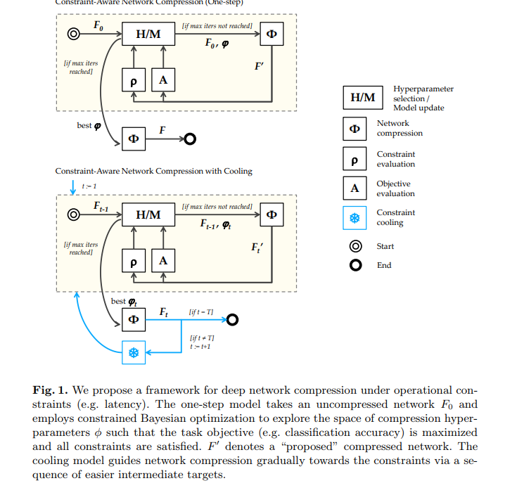
  * 作者利用 *Bayesian Optimization* 能够在参数空间中 *one-step* 找到最优解，但是并非最优 ，*This gradual trajectory provides a sequence of easier targets that approach the constraints, and is governed by a cooling schedule.* 于是，通过引入 *cooling function* ，就是将最终目标划分为多个小目标，于是最终的算法如下
  * 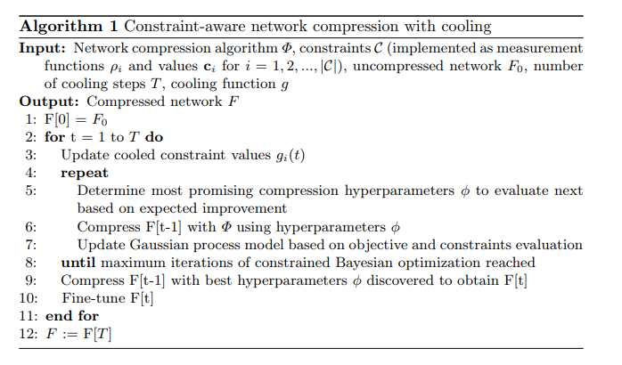
  * 其中，作者将寻找最优参数的过程建模成 *Gaussian process* （*A Gaussian process is an uncountable set of random variables, any finite subset of which is jointly Gaussian.* ，能够很好地利用先验概率）。
  * 
  * cooling function 分为 linear 和 exponential，分成T轮逐步完成最终目标
    * linear: gt=pi(F0)+t/T\*(ci-pi(F0)),可见t=T时，完成最终的压缩
    * exponential： gt=c+e^(t/T)
  * 
* [Designing by Training: Acceleration Neural Network for Fast High-Dimensional Convolution](https://dailongquan.github.io/files/publications/nips2018(1).pdf)
  * 针对高维卷积耗时的问题，提出Acceleration Network (AccNet)，将耗时在设计快速的算法变成训练AccNet的工作
  * 过程分为两步
    * 将splatting, blurring, slicing转为卷积操作
    * 将如上的卷积操作变成 *g* CP layers 去构造AccNet，当训练完成后，激活函数 *g* 和AccNet权重一起定义了新的splatting, blurring and slicing操作

# quantization
* [LQ-Nets: Learned Quantization for Highly Accurate and Compact Deep Neural Networks](http://cn.arxiv.org/abs/1807.10029)
  * 传统的手动量化很死板，灵活的方法不能改变方式的死板，所以需要训练一个量化器 train a QNN and its *quantizer* 量化器随着网络一起训练，基于 * quantization error minimization* 达到最好的效果，*权值* 和 *激活* 皆量化，针对任意bit的量化，逐层且不共享权值
  * 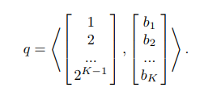
  * 其中左边是mask，右边是量化器，通过增加这样操作可以增强量化数据的表达范围
  * 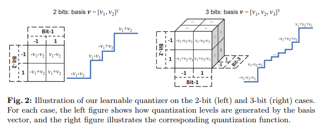
  * 作者用如下的 *quantization error minimization* 来衡量量化误差，其中 *p(x)* 是输入数据的概率密度函数
  * 
  * 文章的量化为vector quantization的变形，*Q=vTel* 这里的*vT* 指代这我们学习的量化的值，*e<subl* 是mask，值域{-1，1}或者{0，1}都可以。 所以也就是通过学习到的值和mask相乘得到量化后的值。文章的量化器的优化也就是优化*vT* 的值使得能够更好地去表达数据
  * 举例如此时的全连接网络中，我们量化的权值和通过激活层的输入的计算方式如下
  * 
  * *quantization error* 的公式是用*l2* 范式累加量化后的数据和原始数据的误差,此时在反向传播中有两个量需要优化，一个是mask一个是VT
  * 
  * 于是用 *block coordinate descent* 的方式，首先用上一次的V更新这次的B，再用这次的B更新这次的V
    * B是用2^k暴力找到使得 *quantization error* 最小的
    * V是用loss求(BBT)-1BX 最小
    * 
    * 每轮重复T次，通常设为1，因为作者实验中增大T没有明显作用
  * 实验结果
  * 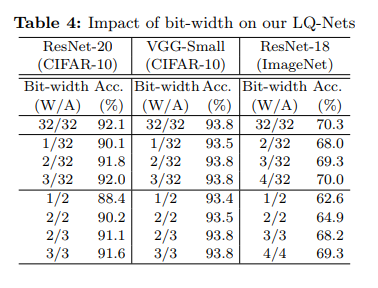 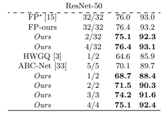
* [Value-aware Quantization for Training and Inference of Neural Networks](https://arxiv.org/abs/1804.07802)
  * *facebook and SNU*
  * 当值域分布越广，量化误差便会越大。由值分布可知，值越小，数目越多，故作者只对*small data*进行量化。本身小数据而言，对网络的影响就很小，故这种量化方法会大大减小量化误差。作者对activations和weights各有一个ratio评判是否为大数据
  * 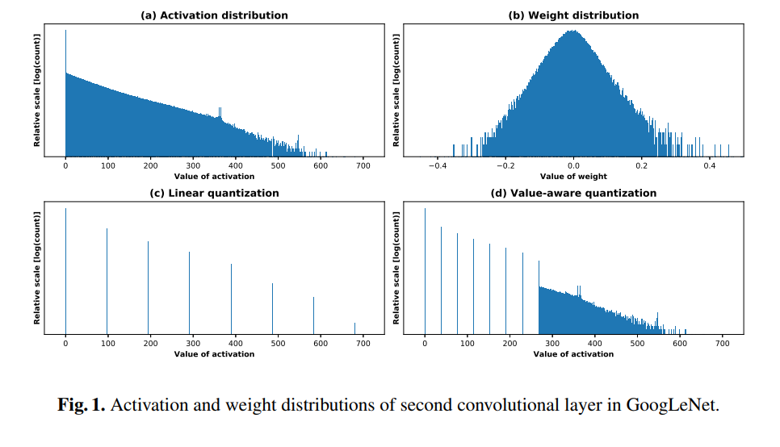
  * 算法：首先在*training*和*inference*阶段定义出什么是*large data*，再只对*small data*量化，*large data* 保持原有精度
    * 为了能够将weights和activations同时都做量化，在训练过程作者作了如下修正
      * 在整个前向过程中全使用全精度计算，所以所得的loss与原网络无异。
      * 反向时用存于本地的quantized activations副本计算梯度
      * 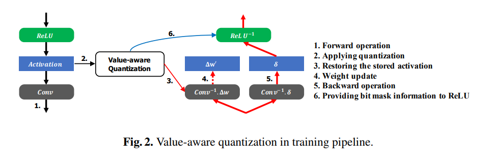
      * 并行训练时，为了避免数据通信的消耗，将*sorting*和*identifying* *large data*只在每张GPU本地完成
        * 并行训练时，每张卡各自量化（各自选择*threshold value*），实验表明并没有很大影响
      * 为了减少额外的mask内存消耗，每个神经元要么存mask信息，要么存*output activation*
        * 当k-bit，2k-1表示value，剩下的一个代表mask
      * *activation annealing*：整个训练过程中的*amount of latge data*波动很大，个数随着iter增多由多变少，所以采用一个逐步的方法
* [Deep Neural Network Compression with Single and Multiple Level Quantization](https://arxiv.org/abs/1803.03289)
  * 本文参照《Quantized Convolution Neural Networks for Mobile Devices》的 *分层量化* 和 *k-means聚类共享权值* 和《Incremental Network Quantization：Towards Lossless CNN with Low-Precision Weights》的 *逐步量化*
   * 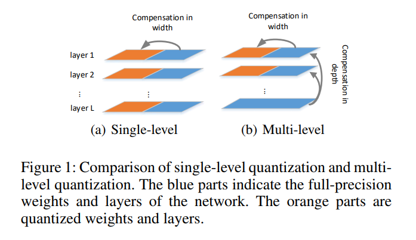
   * 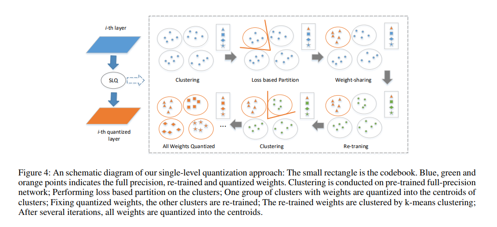
  * 首先*single level quantization*，参数聚类成簇，不同于INQ先量化更大值的参数（基于pruning的灵感），该方法使用基于量化损失的参数划分，量化损失大的簇先被量化(大概是觉得量化损失小的，比较容易用于恢复精度，即变化幅度小)。
     * 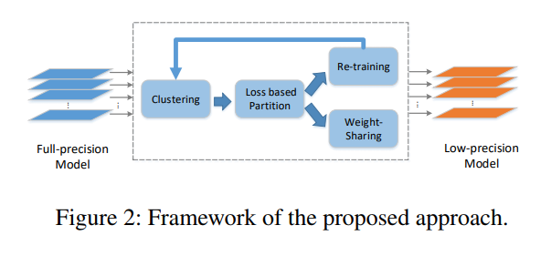
     * 只能对相对高一点精度的量化（8-bit等），当bit较小时，低精度（2-bit等）类数目少，量化误差无法弥补
     * 用mask表示是否被量化，训练只更新未被量化的值，弥补量化带来的loss
     * loss组成为网络本身的loss和（scalar\*量化的误差)
  * *extend SLQ* 8-bit 量化划分为 8-centroids这种
  * *mutiple level quantization*
     * 不同于SLQ一下把每层的待量化层都量化了，MLQ逐层量化待量化层。
     * MLQ的k-means聚类方法的k=3,将影响网络效果大的两个簇称为Boundaries，将影响最小的簇称为heart
      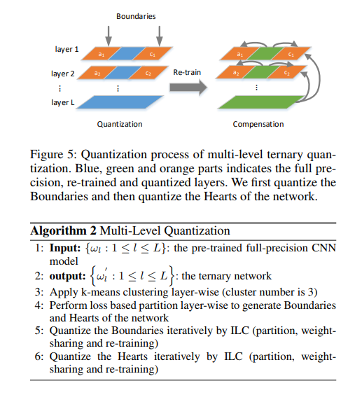
  * *Experiment Results*
    * 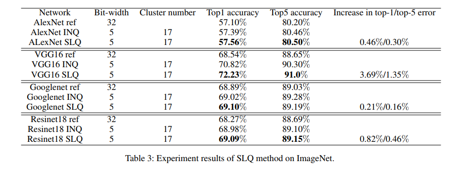
* [Scalable methods for 8-bit training of neural networks](https://arxiv.org/abs/1805.11046)

# pruning
* [Discrimination-aware Channel Pruning for Deep Neural Networks](https://arxiv.org/abs/1810.11809)
  * Tencent AI Lab *discrimination-aware channel pruning*
  * *discrimination-aware loss* and *reconstruction error*
  * 对于一个预训练好的网络剪枝，均匀的加入额外的loss。分成多阶段剪枝，每一阶段将所属层的loss，*reconstruction error*，最后的loss合起来做通道剪枝
  * 念头
    * 传统利用MSE来衡量 *reconstruction error* 的方法太依赖预训练模型的效果
    * 无法精确给中间层网络定性
  * 作者提出的算法分为如下操作
    * 从前往后遍历层，LBL剪枝，对于第i层建立 *construction error*
      * *construction error* 公式的大概意思是 累积当前层中所有channel中每一个类别对最终输出信息的贡献
      * 可变形加入交叉熵，y=ax+b
    * 然后将这个error和本身网络的loss进行反向传播
    * 挑出在反向中最敏感的通道（梯度更新最大的）加入集合A
    * 依据终止条件结束finetune
      * 手动选择个数
      * 矩阵的变动对于初始比例达到一个阈值

# other perspective
* [DeepRebirth: Accelerating Deep Neural Network Execution on Mobile Devices](https://aaai.org/ocs/index.php/AAAI/AAAI18/paper/view/16652)
  * 本文却另辟蹊径，从非权重层入手来进行模型压缩。
  * 如ResNet、GoogLenet等的卷积层都是由很小的卷积核组成，本身就非常紧致了，并且也去掉了非常占参数量的全连接层。而Non-tensor layer（也就是非权重层，如pooling、BN、LRN、ReLU等等）反而成为了模型在cpu以及其他嵌入式硬件上达到real-time的最大阻碍
  * *streamline*
    * 将这一连串的层合并起来(Non-Tensor层（Pooling、LRN）),对于Pooling层，将stride直接乘到Conv层中
  * *branch merging*
    * 主要针对GoogLeNet中的Inception结构
    * 作者将比较细小的卷积层（1*1）以及Pooling层所在的分支，直接合并到和它并排的大卷积分支中
  * 对于一个预训练模型，作者逐层进行合并，合并得到的 *新层* 使用 *标准的初始化方式* ，*其他层的参数保留原预训练模型的参数*，然后将新层的学习率调高为其他层的10倍，进行finetuning，对于某些层，如GoogLenet中的Inception 4b-4d可以一起进行合并在finetuning。
* [Deep k-Means: Re-Training and Parameter Sharing with Harder Cluster Assignments for Compressing Deep Convolutions](http://cn.arxiv.org/abs/1806.09228)
